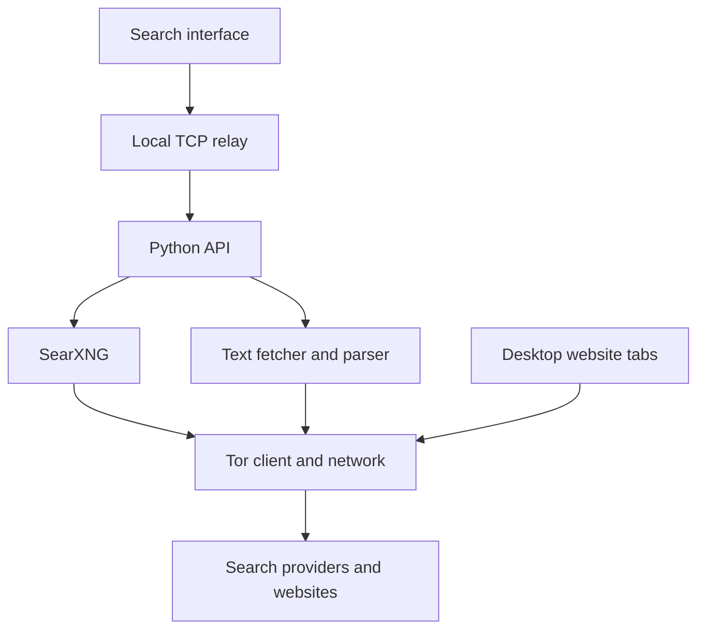

# Hoyahh

**A personal browser, a search interface you run locally, and a workspace you can make your own.**

Hoyahh is a customizable Chromium-based desktop browser with Tor-routed browsing, SearXNG metasearch, and a Material You-inspired new-tab page. It also includes a lightweight web interface for searching and reading pages through Tor in an existing browser.

The project brings search, clickable results, and page navigation into one local setup. It uses Electron for the desktop window, Python for the search API, and Docker for the search and Tor services.

> **Project status:** Early personal browser build. Hoyahh is designed to reduce IP exposure, but it does not make you untraceable or provide Tor Browser's full anonymity protections. Local automated checks have passed; live Windows, DNS/WebRTC leak, and extension compatibility testing remain incomplete.

[Quick start](#quick-start-on-windows) · [How it works](#how-it-works) · [Use cases](#use-cases) · [Customization](#customization) · [Privacy and limitations](#privacy-and-limitations)

## Why Hoyahh exists

Searching privately involves more than choosing a search provider. Search requests, clicks on results, website scripts, and browser storage are separate parts of the experience. Routing a search through Tor does not automatically route the website you open afterward.

Hoyahh connects those steps. Its desktop browser routes website requests through a fixed Tor proxy, while its local search service retrieves results through SearXNG and Tor. The alternative text reader retrieves a page on the backend and returns readable text and links without loading the original website's scripts in your browser.

The project also gives you control over your starting page. Colors, wallpaper, layout, shortcuts, notes, and custom CSS are editable locally. The source is included for changes beyond the settings screen.

## What you can do

| Feature | What it provides |
| --- | --- |
| Desktop browsing | Tabs, an address/search bar, back, forward, reload, and clickable results that open full websites |
| Search across providers | SearXNG queries configured engines and presents results in one interface |
| Tor routing | Search and desktop website requests are configured to use Tor, with no automatic direct fallback |
| Text reading | A simplified view of website text and links, fetched through Tor |
| Search controls | Web, News, and Science categories, pagination, date filters, and Safe Search where supported |
| Provider status | Result-source information and readable timeout, CAPTCHA, rate-limit, or access-denied messages |
| Personal new-tab page | Clock, greeting, shortcuts, notes, wallpaper, colors, and layout settings |
| Custom CSS | Style the desktop toolbar and built-in homepage |
| Extension loading | Load trusted unpacked extensions supported by Electron; some can supply a new-tab page |
| Session controls | Clear visible search results or close desktop tabs and clear website data |

Hoyahh uses [SearXNG](https://docs.searxng.org/) to retrieve results from other search services. It does not crawl the web or maintain an independent search index. The included configuration explicitly enables DuckDuckGo, Google, Bing, Brave, and Wikipedia. Provider availability and filter support vary.

## Use cases

| Use case | Example workflow |
| --- | --- |
| Research across sources | Search a programming topic, inspect which providers returned results, and open documentation in separate tabs |
| A personal browsing workspace | Set your preferred colors, add frequently used websites, and keep local notes beside your search box |
| Reading with fewer distractions | Use the text-reader mode to read supported articles without remote images, scripts, or forms |
| Learning browser development | Explore Electron tabs, sandboxed web contents, preload scripts, and communication between the interface and main process |
| Learning network privacy | Study SOCKS proxies, Tor checks, Docker network isolation, and what happens when a proxy stops |
| A self-hosting project | Run and inspect your own search API and SearXNG configuration instead of depending on a public search instance |

These are practical research, customization, and learning workflows. This experimental build is not a basis for high-risk anonymity claims.

## Choose your launch mode

| | Desktop browser | Search and text reader |
| --- | --- | --- |
| Windows launcher | `start-browser.bat` | `start.bat` |
| Opens in | Hoyahh's own desktop window | Your existing browser at `http://127.0.0.1:8787` |
| Clicking a result | Opens a full website in a new Hoyahh tab | Opens extracted text and links inside the search app |
| Website JavaScript and images | Supported, subject to browser restrictions | Not loaded by the reader |
| Website forms and sign-in | Ordinary forms can work; some authentication methods are blocked | Unsupported |
| Custom new-tab dashboard | Included | Not included |
| Separate Tor Browser installation | Not needed | Not needed |

Using the local web interface does not route other tabs in your existing browser through Tor. Addresses copied and opened outside Hoyahh use that application's connection.

## Quick start on Windows

### Requirements

- Windows x64 or ARM64 for the included desktop launcher.
- Docker Desktop running with Linux containers enabled.
- An internet connection for setup downloads and Tor connectivity.
- Disk space for Docker images and the extracted Electron runtime.

The Windows launchers do not require a separate Node.js, Python, or Tor Browser installation. Node.js is only needed for the optional desktop development workflow.

### First run

1. Download and extract the project. Keep its files together in one folder.
2. Open Docker Desktop and wait until its engine is running.
3. Double-click **`start-browser.bat`** for the desktop browser.
4. Wait for the Docker services, startup checks, and first-time runtime download to finish.
5. In Hoyahh, click **Check Tor**. Tor may need a few minutes to connect.
6. Search from the homepage or address bar, then click a result to open its website.

The launcher builds the services, generates a local secret if needed, and checks the search containers for direct TCP and public DNS access. If these startup checks fail, it stops the stack.

The first desktop launch downloads the pinned Electron runtime from its official GitHub release, checks the archive against the release's SHA-256 checksum list, extracts it into `browser-runtime`, and opens the app. Later launches reuse that runtime. Setup downloads use your computer's normal connection.

To use only search and the text reader, run **`start.bat`** instead.

### Stop or update

Close the desktop window and run **`stop.bat`**. Closing the browser alone does not stop Docker.

Before replacing project files, stop the old stack:

```powershell
docker compose down
```

Copy the updated project's contents into the existing folder and replace matching files. Keep `.env` and `browser-runtime`; the latter avoids downloading Electron again. Run `start-browser.bat` afterward. Ordinary `docker compose down` preserves the Tor state volume; do not add `--volumes` for routine updates.

You can delete downloaded ZIP archives after extracting them. Keep the extracted project folder.

### Linux and macOS

The included shell launcher starts the search/text-reader interface:

```sh
sh start.sh
```

Open `http://127.0.0.1:8787`, check Tor, and search. Stop the services with `docker compose down`. An equivalent one-click desktop runtime installer is not included for these platforms.

## How it works

### Architecture



The diagram shows outbound request paths. Responses return through the corresponding services. Tor verification is an additional check before searches, reader requests, and eligible desktop navigations.

### 1. Searching

The interface sends the query in a POST body to the local API through a fixed-destination TCP relay. The API checks Tor and, if verification succeeds, forwards the search to SearXNG. SearXNG contacts its configured providers using `socks5h://tor:9050`, which also delegates destination-name resolution to the proxy.

The API returns results and sanitized provider-status information. The search interface keeps the query and results in memory, outside its URL and without an app-owned query-history database. Providers still receive the search terms.

### 2. Opening full websites

In desktop mode, a result click requests a new Chromium tab through a narrow, validated application interface. Remote tabs use a separate browser session configured with the fixed SOCKS5 proxy `127.0.0.1:9060`. The browser awaits proxy setup before loading content and has no configured DIRECT fallback.

The local search page uses a different session restricted to the local search service. Remote websites receive no privileged preload script or Node.js access. This separation keeps website code away from the browser's application controls.

The browser checks its own Tor route at startup and when requested. New address/result navigations trigger another check when the last successful check is older than 60 seconds. Page-internal navigation continues to use the fixed proxy. A checked badge reports a past check, not continuous verification.

### 3. Reading text-only pages

In web-interface mode, a result click goes to the reader API. After checking Tor, the backend fetches the page through the Tor proxy, validates redirects, and extracts text and safe link targets. The frontend displays those as text nodes and buttons; it never inserts the original remote HTML.

The reader accepts supported public HTTPS pages, upgrades ordinary HTTP links to HTTPS, and rejects private addresses, IP-literal targets, special ports, and onion URLs. Each fetch is bounded to roughly 2 MiB and a 50-second fetch/redirect budget, plus verification time. Output is limited to 120,000 characters and 500 blocks. Scripts, forms, images, videos, PDFs, and sign-in are unsupported in this view.

### Why Docker is used

Docker runs four services with distinct responsibilities:

| Service | Responsibility |
| --- | --- |
| `app` | Validates requests, checks Tor, and serves the search/reader API |
| `gateway` | Relays local browser connections only to `app:8787` |
| `searxng` | Queries search providers and combines their results |
| `tor` | Runs Tor, exposes an internal verifier, and performs reader fetches |

The app and SearXNG attach only to an internal Docker network. The Tor container has a separate network for internet access. The relay joins the internal network and a browser-access network so Docker Desktop can publish its local port.

Search mode exposes only `127.0.0.1:8787`. Desktop mode adds the loopback SOCKS port `127.0.0.1:9060` through `compose.browser.yaml`. This setup is intended for one computer, not a public hosted service.

## Customization

Open **Customize** or press **Ctrl+,** in the desktop browser.

- Change your greeting name, colors, local font, text size, and corner radius.
- Choose a balanced, centered, or wide homepage layout.
- Set a local wallpaper and show or hide clock and notes widgets.
- Add shortcuts using one `Name | https://website` entry per line; reorder the lines to reorder shortcuts.
- Add custom CSS for the toolbar and built-in homepage.
- Import or export your settings, including notes and wallpaper.

Custom CSS is temporarily disabled while settings is open, so you can recover if a style hides controls. Remote CSS, fonts, and wallpaper URLs are blocked in the shell; choose a local image instead.

Settings are saved locally. The legacy `%APPDATA%\Veil Browser` profile name and some internal `veil-search` identifiers are retained for upgrade compatibility. The displayed product name is Hoyahh.

There is no paid customization tier. The source is editable, but technical size limits and security restrictions still apply.

### Keyboard shortcuts

| Shortcut | Action |
| --- | --- |
| `Ctrl+L` | Focus the address bar |
| `Ctrl+T` | Open a new tab |
| `Ctrl+W` | Close the current tab |
| `Ctrl+Tab` / `Ctrl+Shift+Tab` | Switch tabs |
| `Ctrl+R` | Reload the current website tab |
| `Alt+Left` / `Alt+Right` | Navigate backward or forward |
| `Ctrl+,` | Toggle customization settings |

## MYNT and extensions

The built-in homepage is an original implementation inspired by Material You and [MYNT](https://github.com/prem-k-r/materialYouNewTab). MYNT itself is not bundled, and compatibility has not been verified.

To try a trusted extension, choose **Customize → Load unpacked extension** and select its extracted folder containing `manifest.json`. Review the requested permissions. Compatible extensions declaring a new-tab override appear in the **New-tab page** dropdown. Select one, save, and open a new tab. The Home button still opens Hoyahh's built-in dashboard.

Electron supports only a subset of Chrome extension APIs; packed CRX files and Chrome Web Store installation are unsupported. Extension settings or popups open in a tab. Extensions can read page data or transmit it, so Tor routing alone does not make an extension trustworthy. See [Electron's extension documentation](https://www.electronjs.org/docs/latest/api/extensions-api).

## Privacy and limitations

| Area | Implemented behavior and remaining limit |
| --- | --- |
| Search and reader routing | Configured to use Tor; failed verification blocks requests. Providers still see queries. |
| Desktop website routing | Fixed Tor proxy with implicit loopback bypass removed. This is application-level configuration, not a system firewall. |
| DNS and WebRTC | Destination DNS is intended to use SOCKS; local Chromium resolution is restricted, QUIC is disabled, and non-proxied WebRTC UDP is disabled. Live leak testing remains incomplete. |
| Website execution | Remote tabs use sandboxing and context isolation with Node integration disabled. Website JavaScript can still fingerprint the browser. |
| Website permissions | Camera, microphone, geolocation, notifications, screen capture, and device permissions are denied. Some sites will not work fully. |
| Search history | No app-owned persistent query database. Clearing the search view does not erase records elsewhere. |
| Website storage | Desktop cache and storage are cleared at startup, through the clear-data control, and at clean exit. Crashes can leave data on disk. Clearing is not secure erasure. |
| Saved personal data | Notes, appearance, shortcuts, and extension folder choices persist separately. Exported settings can contain personal notes. |
| Logs | HTTP request logging and Docker log capture are disabled in the supplied configuration. OS, setup-tool, extension, or third-party records may still exist. |
| Tor state | A Docker volume retains guard/network state across restarts; this is separate from search history. |
| Other applications | Hoyahh does not route your whole computer, other browsers, or other applications through Tor. |

Tor does not conceal identifying logins or prevent all traffic analysis. Your network provider may observe Tor use. Hoyahh's custom Chromium environment does not offer Tor Browser's fingerprint uniformity and hardening. Read the [Tor Project's privacy guidance](https://support.torproject.org/tor-browser/security/using-tb-safely/) before making anonymity assumptions.

Downloads are currently blocked. Password management, Chrome Sync, DRM playback, and automatic browser updates are not implemented. Some websites block Tor, require unsupported APIs, or fail under the browser restrictions. The desktop browser accepts some onion navigation paths; the text reader does not. Neither mode guarantees access to every site.

## Troubleshooting

| Symptom | What to do |
| --- | --- |
| Docker is unavailable | Open Docker Desktop with Linux containers enabled, then rerun the launcher. |
| A PowerShell counter says “bytes written” | The first-time runtime download is progressing. Leave the window open until verification and extraction finish. |
| The page at port 8787 does not open | Run `docker compose ps -a` and `diagnose.bat` from the project folder. Check that all four services are running. |
| Tor check fails | Wait for Tor to connect and retry. Your network or the checker may be unavailable; requests remain blocked. |
| Only one provider returns results | Open **Provider status**, try **Web** and **Any time**, and inspect timeout or CAPTCHA messages. Enabled engines are not guaranteed to respond. |
| A full website fails | Check Tor and try another site. The site may block Tor or require a feature Hoyahh does not support. |
| A reader page fails | It may require JavaScript, authentication, compression, or an unsupported content type. Try another result or the desktop mode. |
| Isolation check fails | Keep the stack stopped and inspect the failure. Do not remove the checks or give SearXNG direct internet access as a workaround. |
| Old name appears in Docker or a profile path | Legacy internal identifiers are retained for compatibility; this does not mean the visible rename failed. |

When reporting a problem, include the launch mode, operating system, service status, and a non-sensitive error message. Remove private queries, URLs, credentials, and personal notes from reports.

## Project structure

| Path | Purpose |
| --- | --- |
| `browser/main.cjs` | Desktop window, tabs, sessions, Tor checks, settings, and extension management |
| `browser/policy.cjs` | Address validation, request policy, and customization defaults |
| `browser/preload.cjs`, `browser/search-preload.cjs` | Limited communication between local interfaces and the desktop process |
| `browser/ui/` | Browser toolbar, new-tab page, and customization interface |
| `dist/` | Search interface, result display, text reader, and local styles |
| `server.py` | Python API, request validation, Tor checks, and response handling |
| `gateway.py` | Fixed-destination local TCP relay |
| `searxng/settings.yml` | Search engines, filters, and Tor proxy configuration |
| `tor/` | Tor configuration, supervisor, verifier, page fetcher, and text parser |
| `compose.yaml`, `compose.browser.yaml` | Container services, network isolation, and optional desktop SOCKS port |
| `start-browser.bat`, `setup-browser.ps1` | Windows desktop launcher and runtime setup |
| `start.bat`, `start.sh`, `stop.bat` | Search-mode startup and service shutdown |
| `network_check.py`, `diagnose.bat` | Startup isolation checks and diagnostics |
| `tests/`, `browser/tests/` | Python tests and mocked desktop policy/lifecycle tests |

For more desktop details, see [browser/README.md](browser/README.md).

## Development and verification

From the project root, with Python 3.10 or newer installed:

```sh
python -m unittest discover -s tests -v
```

With Node.js installed, the desktop policy and mock lifecycle tests run without downloading Electron:

```sh
node --test browser/tests/lifecycle.test.cjs browser/tests/policy.test.cjs
```

For Electron development, start the Docker backend with the desktop Compose override, then run `npm ci` and `npm start` from `browser/`. On Windows PowerShell, use `npm.cmd` if script execution policy blocks `npm.ps1`.

The implemented release has passed 27 Python tests and 8 Node tests. They cover request validation, failed Tor checks, reader extraction, redirect handling, relay forwarding, session separation, sandbox settings, and rejected privileged IPC calls. The branding update also passed the 8 Node checks. These are local/mock checks, not proof of live anonymity.

The complete desktop release has not been verified in a Windows GUI or subjected to a live DNS/WebRTC leak audit. To examine behavior on your own computer, use non-sensitive searches, verify Tor, stop the Tor container, and confirm that fresh searches and website visits fail rather than connecting directly. Restart Tor afterward. Passing that check alone is not a complete security audit.

Electron is pinned to `44.3.0` in the desktop package and setup script. Docker images include mutable tags such as SearXNG `latest`; the whole stack is not fully reproducible. Review updates deliberately, keep desktop package/lockfile and setup versions aligned, and repeat relevant verification after changing dependencies.

## Contributing

Bug reports, documentation improvements, accessibility fixes, and reproducible compatibility reports are welcome. Keep changes focused and explain what you tested. For network-related changes, show that a failed Tor connection cannot silently fall back to a direct one.

Do not commit `.env`, downloaded runtimes, dependency folders, personal profile data, or exported settings containing notes. The supplied `.gitignore` excludes the generated secret, runtime directory, Python cache, and browser dependencies.

## License and acknowledgments

Hoyahh source is distributed under the [MIT License](LICENSE). Electron/Chromium, SearXNG, Tor, Python, curl, Alpine, and Docker retain their respective licenses; Hoyahh's license does not relicense them. Material You and MYNT are design references, not bundled products or endorsements.

Built with [Electron](https://www.electronjs.org/), [SearXNG](https://docs.searxng.org/), and [Tor](https://www.torproject.org/), with services managed through Docker Compose.

